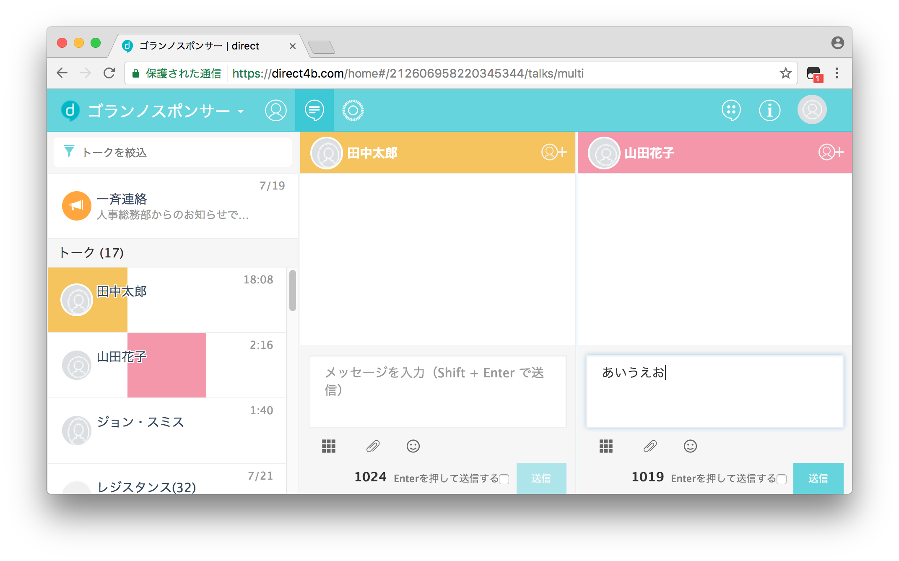

# direct helper

ビジネス用チャットツール[direct](https://direct4b.com/ja/)に便利な機能を追加するユーザースクリプト

## サンプル

## インストール方法
### ユーザースクリプトマネージャーをインストール
ユーザースクリプトを実行するために、以下のいずれかのユーザースクリプトマネージャーをインストールしてください。  

* [Greasemonkey](http://www.greasespot.net)
* [Tampermonkey](https://tampermonkey.net/)
* [Violentmonkey](https://violentmonkey.github.io)

direct helperは、ChromeのTampermonkeyで動作確認をしています。

### ユーザースクリプトをインストール
* [direct_helper.user.js](https://github.com/munierujp/direct_helper/raw/master/src/direct_helper.user.js)

上記ファイルをスクリプトマネージャーにインストールしてください。  
Tampermonkeyの場合、リンクをクリックするとインストール画面が表示されます。

## 使用方法
direct helperが有効なとき、directの右上にアイコンが表示されます。  
アイコンをクリックすると、設定画面が開きます。  
設定画面で使用したい機能をオンにすることで、その機能が有効になります。

## 機能
### ユーザーダイアログ
#### ユーザーアイコンの拡大
ユーザーアイコンをクリックで拡大表示します。

### 画像
#### サムネイルサイズの変更
画像のサムネイルサイズを変更します。

#### サムネイル画像をぼかす
サムネイル画像にブラー効果をかけてぼかします。

### メッセージ入力
#### 送信ボタンの確認
送信ボタンによるメッセージ送信前に確認します。

#### 入力文字数の表示
入力文字数をカウントダウン形式またはカウントアップ形式で表示します。

### マルチビュー
#### マルチビューのレスポンシブ化
選択状態に応じてマルチビューのカラム数を動的に変更します。

### メッセージ監視  
メッセージを監視してコンソールに出力します。シングルビューでのみ動作します。

## 設定
directの環境設定画面から、各種設定を変更できます。

### ログ
#### 日付フォーマット
日付フォーマットには、以下のパターン文字が使用可能です。

|文字|内容|
|---|---|
|`yyyy`|年（4桁）|
|`yy`|年（2桁）|
|`MM`|月（2桁）|
|`M`|月（1～2桁）|
|`dd`|日（2桁）|
|`d`|日（1～2桁）|
|`e`|曜日（漢字）|
|`HH`|時（2桁）|
|`H`|時（1～2桁）|
|`mm`|分（2桁）|
|`m`|分（1～2桁）|
|`ss`|秒（2桁）|
|`s`|秒（1～2桁）|

#### カスタムタグ
##### メッセージ監視開始文
|タグ|内容|
|---|---|
|`<time>`|監視開始日時|

##### トーク監視開始文
|タグ|内容|
|---|---|
|`<talkId>`|トークID|
|`<talkName>`|トーク名|
|`<time>`|監視開始日時|

##### メッセージヘッダー
|タグ|内容|
|---|---|
|`<talkId>`|トークID|
|`<talkName>`|トーク名|
|`<time>`|発言日時|
|`<userName>`|ユーザー名|

## 開発方法
[CONTRIBUTING.md](.github/CONTRIBUTING.md)を参照してください。

## コンタクト
* [GitHub](https://github.com/munierujp/direct_helper)
* [Twitter](http://twitter.com/munieru_jp)
