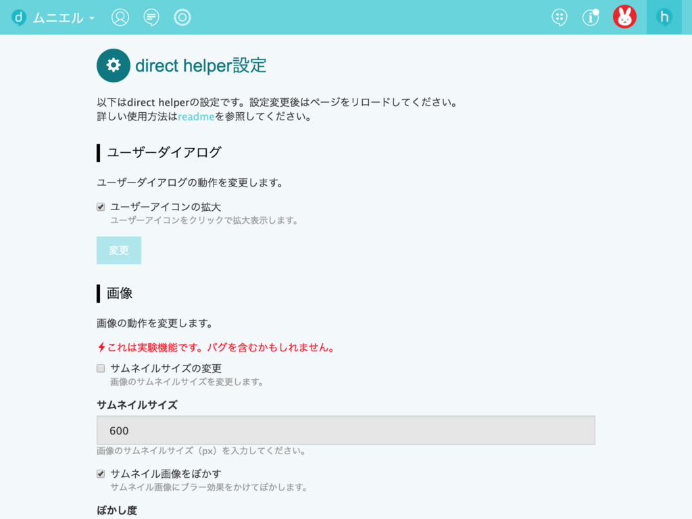
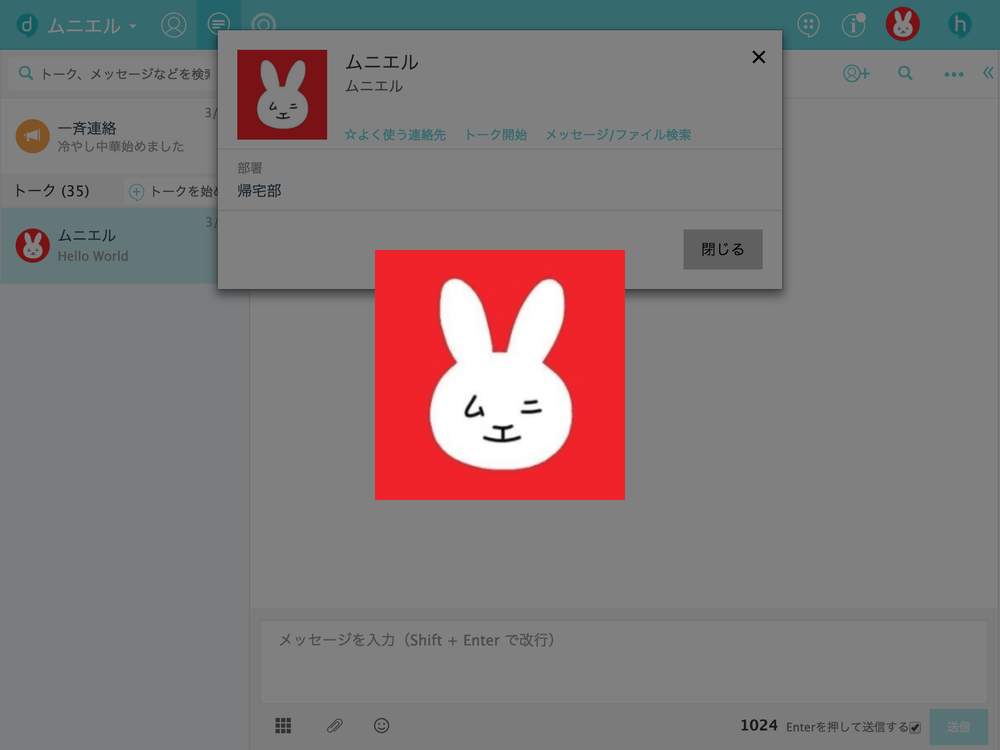
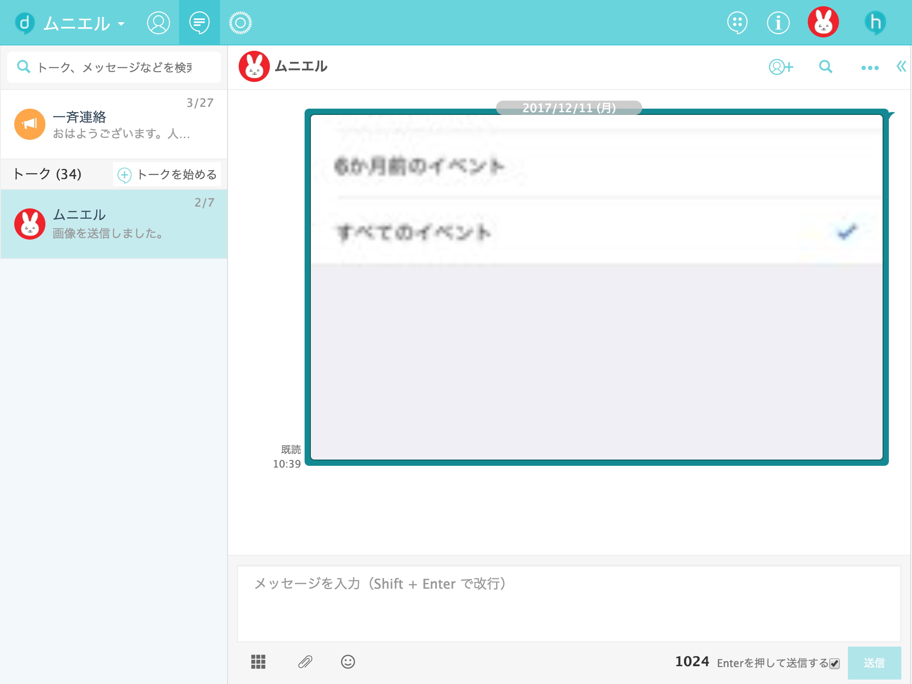
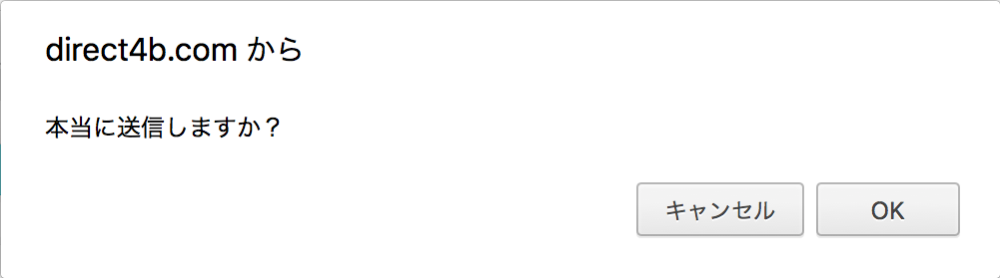
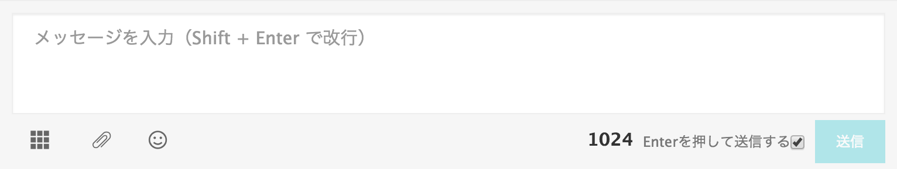
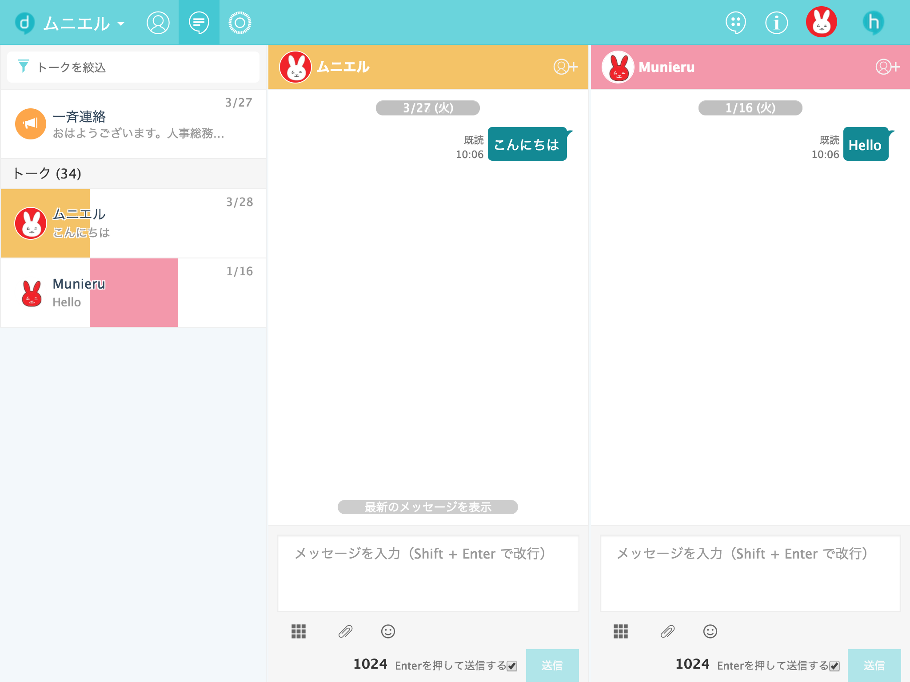
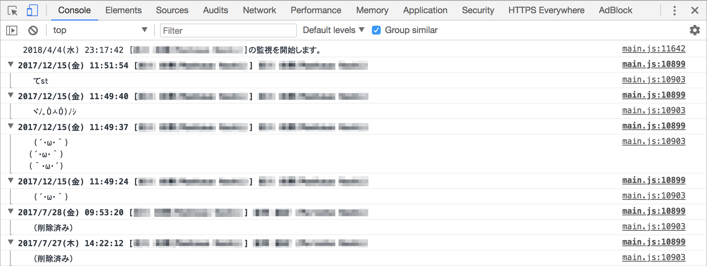

# direct helper

ビジネスチャットツール[direct](https://direct4b.com/ja/)に便利な機能を追加するChrome拡張

## インストール方法
* [direct helper](https://chrome.google.com/webstore/detail/fhbllgfoempopcijliicheinpdbohdic/)

上記リンクからChromeウェブストアを開き、インストールしてください。

## 使用方法
direct helperが有効なとき、directの画面右上にアイコンが表示されます。

アイコンをクリックすると、設定画面が表示されます。

設定画面で使用したい機能をオンにすることで、その機能が有効になります。

## 機能
### ユーザーアイコンの拡大

ユーザーダイアログのアイコンをクリックすると、画像を拡大表示します。

### サムネイルサイズの変更

サムネイル画像のサイズを変更します。  
サイズは自由に指定できます。

### サムネイル画像をぼかす

サムネイル画像にブラー効果をかけてぼかします。  
ぼかし度は自由に指定できます。

### 送信ボタンの確認

送信ボタンによるメッセージ送信前に、ダイアログで確認します。

### 入力文字数の表示

メッセージ入力欄に、入力文字数を表示します。  
表示形式は、カウントダウン形式かカウントアップ形式を選べます。

### マルチビューのレスポンシブ化

デフォルトでは3カラム固定であるマルチビューのカラム数を、選択状態に応じて動的に変更します。

### メッセージ監視

メッセージを監視してコンソールに出力します。  
複数のトークを行ったり来たりすることなく、メッセージを読むことができます。

## 設定
directの環境設定画面から、各種設定を変更できます。

### ログ
#### 日付フォーマット
日付フォーマットには、以下のパターン文字が使用可能です。

|文字|内容|
|---|---|
|`yyyy`|年（4桁）|
|`yy`|年（2桁）|
|`MM`|月（2桁）|
|`M`|月（1～2桁）|
|`dd`|日（2桁）|
|`d`|日（1～2桁）|
|`e`|曜日（漢字）|
|`HH`|時（2桁）|
|`H`|時（1～2桁）|
|`mm`|分（2桁）|
|`m`|分（1～2桁）|
|`ss`|秒（2桁）|
|`s`|秒（1～2桁）|

#### カスタムタグ
##### メッセージ監視開始文
|タグ|内容|
|---|---|
|`<time>`|監視開始日時|

##### トーク監視開始文
|タグ|内容|
|---|---|
|`<talkId>`|トークID|
|`<talkName>`|トーク名|
|`<time>`|監視開始日時|

##### メッセージヘッダー
|タグ|内容|
|---|---|
|`<talkId>`|トークID|
|`<talkName>`|トーク名|
|`<time>`|発言日時|
|`<userName>`|ユーザー名|

## 開発方法
[CONTRIBUTING.md](.github/CONTRIBUTING.md)を参照してください。

## コンタクト
* [GitHub](https://github.com/munierujp/direct_helper)
* [Twitter](http://twitter.com/munieru_jp)
