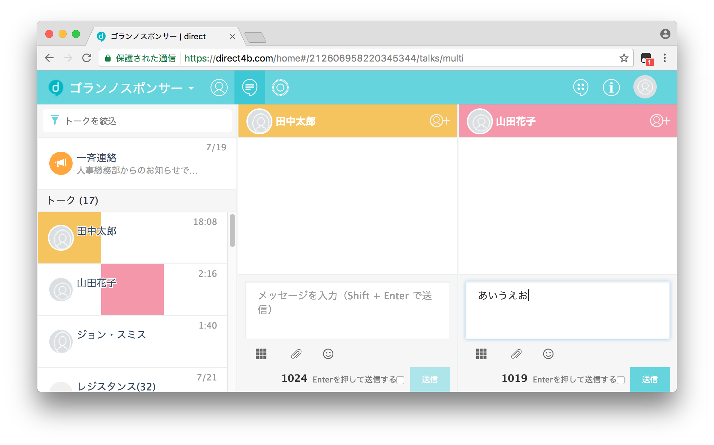

# direct helper

ビジネス用チャットツール[direct](https://direct4b.com/ja/)に便利な機能を追加するユーザースクリプト。

## インストール方法
### ユーザースクリプトマネージャーをインストール
ユーザースクリプトを実行するために、以下のいずれかのユーザースクリプトマネージャーをインストールしてください。  

* [Greasemonkey](http://www.greasespot.net)
* [Tampermonkey](https://tampermonkey.net/)
* [Violentmonkey](https://violentmonkey.github.io)

direct helperは、ChromeのTampermonkeyで動作確認をしています。

### スクリプトをインストール
* [direct helper.user.js](https://github.com/munierujp/direct_helper/raw/master/direct%20helper.user.js)

上記ファイルをスクリプトマネージャーにインストールしてください。  
Tampermonkeyの場合、リンクをクリックするとインストール画面が表示されます。

## 使用方法
direct helperが有効なとき、directの環境設定画面末尾にdirect helpr用の設定項目が追加されます。  
使用したい機能の設定をオンにすることで、その機能が有効になります。

## 機能
### ユーザーダイアログ
#### ユーザーアイコンの拡大
ユーザーアイコンをクリックで拡大表示します。

### 画像
#### サムネイルサイズの変更
画像のサムネイルサイズを変更します。

#### サムネイル画像をぼかす
サムネイル画像にブラー効果をかけてぼかします。

### メッセージ入力
#### 送信ボタンの確認
送信ボタンによるメッセージ送信前に確認します。

#### 入力文字数の表示
入力文字数をカウントダウン形式で表示します。

### マルチビュー
#### マルチビューのレスポンシブ化
選択状態に応じてマルチビューのカラム数を動的に変更します。

### メッセージ監視  
メッセージを監視してコンソールに出力します。シングルビューでのみ動作します。

## 設定
directの環境設定画面から、各種設定を変更できます。

### ログ
#### 日付フォーマット
日付フォーマットには、以下のパターン文字を使用可能です。  
パターン文字はJavaの[DateTimeFormatter](https://docs.oracle.com/javase/jp/8/docs/api/java/time/format/DateTimeFormatter.html#patterns)に基いています。

|文字|内容|
|---|---|
|`yyyy`|年（4桁）|
|`yy`|年（2桁）|
|`MM`|月（2桁）|
|`M`|月（1～2桁）|
|`dd`|日（2桁）|
|`d`|日（1～2桁）|
|`e`|曜日（漢字）|
|`HH`|時（2桁）|
|`H`|時（1～2桁）|
|`mm`|分（2桁）|
|`m`|分（1～2桁）|
|`ss`|秒（2桁）|
|`s`|秒（1～2桁）|

#### カスタムタグ
##### メッセージ監視開始文
|タグ|内容|
|---|---|
|`<time>`|監視開始日時|

##### トーク監視開始文
|タグ|内容|
|---|---|
|`<talkId>`|トークID|
|`<talkName>`|トーク名|
|`<time>`|監視開始日時|

##### メッセージヘッダー
|タグ|内容|
|---|---|
|`<talkId>`|トークID|
|`<talkName>`|トーク名|
|`<time>`|発言日時|
|`<userName>`|ユーザー名|

## 解説
### Optional
自作のライブラリ[Optional.js](https://github.com/munierujp/Optional.js)を使用しています。

### Iterator
自作のライブラリ[Iterator.js](https://github.com/munierujp/Iterator.js)を使用しています。

### Observer
自作のライブラリ[Observer.js](https://github.com/munierujp/Observer.js)を使用しています。

### Replacer
自作のライブラリ[Replacer.js](https://github.com/munierujp/Replacer.js)を使用しています。

### 設定の保存
ブラウザのローカルストレージ上にJSON形式で各種設定を保存しています。  
デフォルトのキーは`direct_helper_settings`です。

### 設定画面の描画
環境設定画面のDOMを書き換えることで、direct helper用の設定項目を追加しています。  
変更ボタンの挙動は、可能な限りオリジナルのものを再現しています。

### 設定項目の定義  
設定項目はソースコード上に定数オブジェクトとして定義しており、容易に追加可能な設計になっています。  
以下の仕様に従って追加することで、設定関連処理を自動的に行ないます。

#### 仕様
##### root
|プロパティ|型|必須|内容|
|---|---|---|---|
|key|String|○|キー|
|name|String|○|名前|
|description|String|-|説明|
|items|Object|-|設定項目|

##### items
|プロパティ|型|必須|内容|
|---|---|---|---|
|key|String|○|キー|
|name|String|○|名前|
|description|String|-|説明|
|type|FormType|○|フォーム種別|
|default|?|○|デフォルト値|
|parentKey|String|-|親キー|

### 日付フォーマット
日付文字列を生成する際、パターン文字を実際の値に置換しています。

### カスタムタグ
各種文字列を生成する際、カスタムタグを実際の値に置換しています。

## コンタクト
* [GitHub](https://github.com/munierujp/direct_helper)
* [Twitter](http://twitter.com/munieru_jp)
